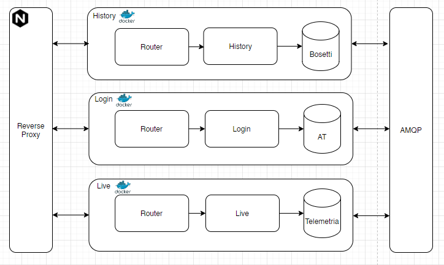

[](http://commitizen.github.io/cz-cli/)
[](https://github.com/lucagump/eagletrt-api/blob/main/LICENSE)

# eagletrt-api
This project consists of an [express](https://expressjs.com/) rest API server written in Typescript.
It's a cloud-based application composed of different microservices developed with Node Js, Docker, NGINX, MongoDB.  The project is up and running (_i hope_) [here](https://theuselessweb.com/).


## Project Structure



## Install
```javascript
git clone https://github.com/lucagump/eagletrt-api.git
cd users
npm install
```

## Config

Clone the repository, install the module and place the .env file with tokens and variables. 

## Env Files
Place the `.env` file in each root of the microservices.<br>
The test file should be called `.env.test` and it's used during local tests.<br>

`.env`
```
PORT=3030
DB_NME=rememo
DB_HOSTNAME=<insert-your-connection-string>
```

## API Documentation 

The complete generated document of the API is available [here](https://documenter.getpostman.com/view/3504740/TVCjx5xT#33c906b0-350f-4e19-a0e6-09d6a9aab648). It's possible to check the documentation of each microservices on the route _/api-docs_ 

## Report


The [report ](https://github.com/lucagump/eagletrt-api/blob/main/documents/report.pdf) is in the /documents folder  

## Scripts cheetsheet
The application come with several npm scripts:
* `npm run serve` - Transpile and run the application in one command
* `npm run start` - Start the app with nodemon
* `npm run transpile` - Transpile the typescript file to javascript
* `npm run commit` - Commit with commitizen
* `npm run commit:sign` - Signed commit with commitizen
* `npm test` - Transpile the application and run all the tests
