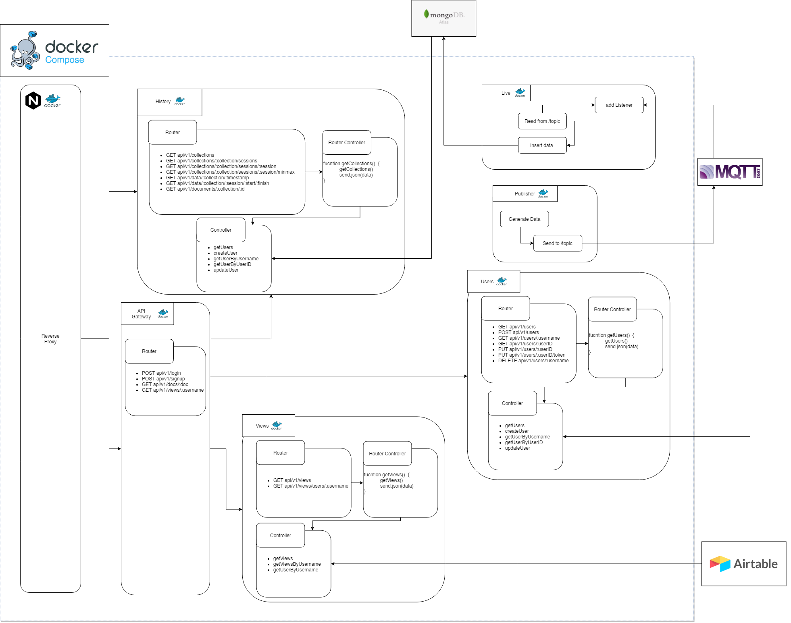
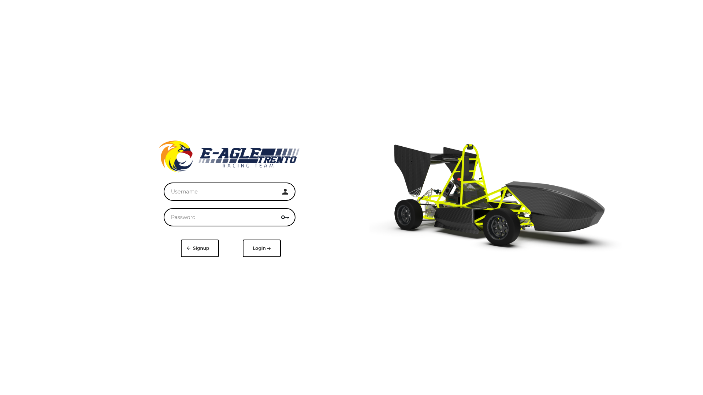
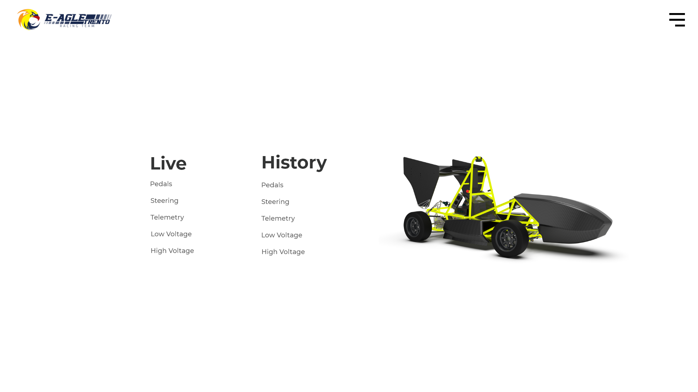
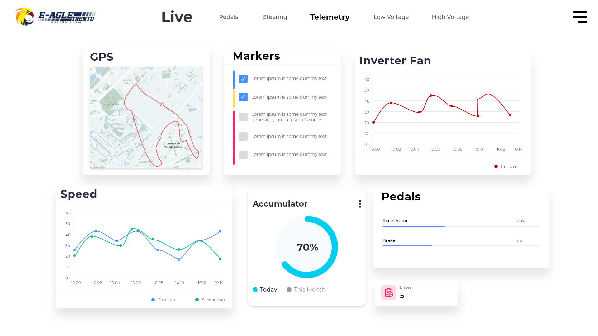
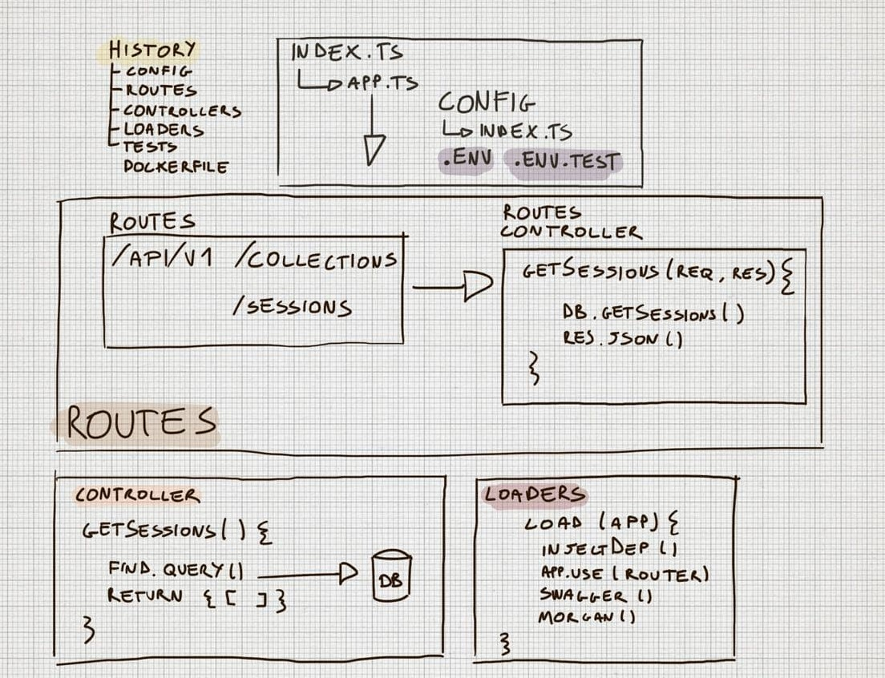
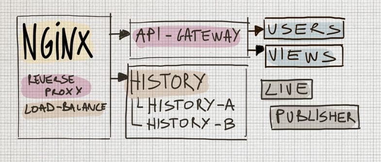
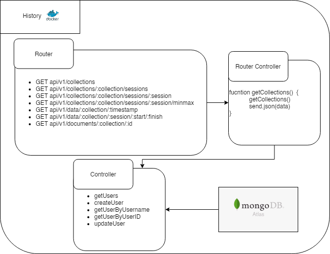
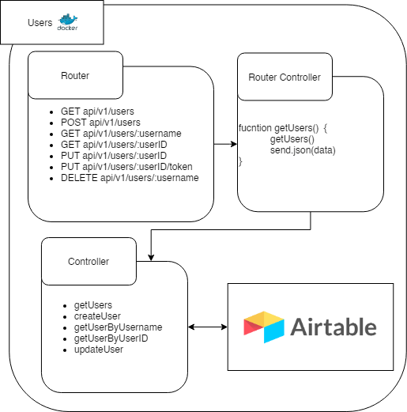
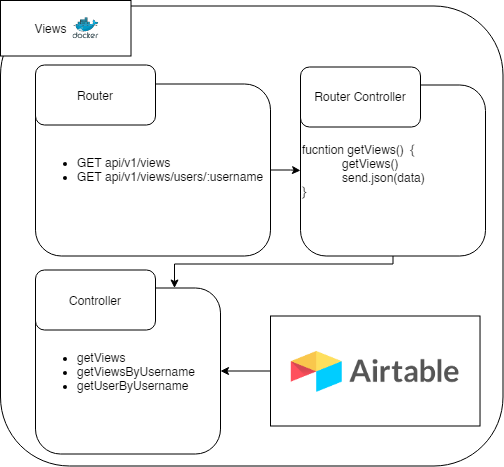
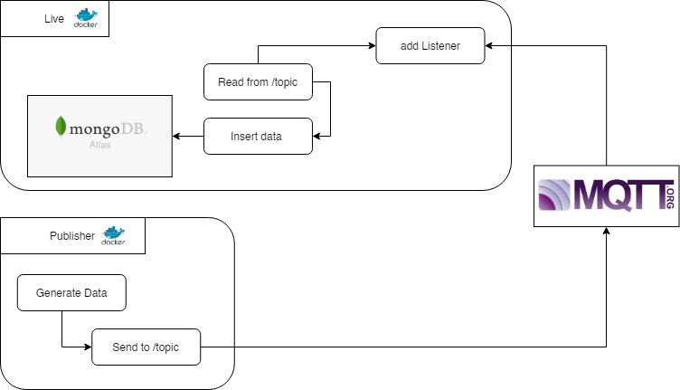

[](http://commitizen.github.io/cz-cli/)
[](https://github.com/lucagump/eagletrt-api/blob/main/LICENSE)

# eagletrt-api

## Technologies

This project consists of an [express](https://expressjs.com/) rest API server written in Typescript.
It's a cloud-based application. It's built with different microservices developed with Node Js, Docker, NGINX, MongoDB and MQTT. The project is up and running (_i hope_) [here](https://theuselessweb.com/).

## Goal

This application is the result of the continuos research of the telemtry group from 2018 untill 2021. The result is a maintainable application to serve the telemtry web-app used byt the member of the team.
The main focus is to serve the webapp by giving the data to render the charts of the vehicle during the tests. Each user should have the possiblity to see a customizable page with charts and configuration of the vehicle. Further user stories could be implemented starting from this _zero_ version of the software.

## Project Structure (Version 1)



### Todo 

+ [ ] Fix port from config
+ [X] Auth Middleware History
+ [X] Views in api-gateway
+ [X] Authentication
+ [ ] MongoDB Paging [Guide] (https://scalegrid.io/blog/fast-paging-with-mongodb/)
+ [X] Joi Airtable
+ [ ] Typedoc
+ [X] Mockup web-app
+ [ ] Swagger to NGINX Configuration [Script] (https://gist.github.com/nginx-gists/37ce65292a06219ff8d35d293c05e0b5#file-oas2nginx-sh)
+ [X] New Tests
+ [ ] Check NGINX configuration 
+ [ ] Heroku CI
+ [X] Dockerfile
+ [X] docker-compsoe.yml

## Webapp Mockup

The webapp mockup is designed according to the feedback gathered via a questionnaire in 2019. 
Other interactions are required to validate the usability and the complete set of functionalities needed for tests and race events.

### Login



### Homepage - Menu



### Homepage - Menu



## MicroServices


The template used to build the microservice architecture is described above. 
It consists of four main folder:  
* **loaders**: to inject dependencies, routes and all sort of configuration. 
* **routes**: where the route of the API are described with the swagger code. It also has a _controller.ts_ to handle requests.
* **controllers**: it's where the magic is, all the sauce of the project. This folder contains all the functions used to retrieve data from the  database or to interact with external API.
* **tests**: it runs the application as a different process in order to test _newman_ requests.
* **config**: with the _index.ts_ it's possible to load all the .env variables, it's based on the environment (test or production) 

### NGiNX


NGINX is an open-source web server that also serves as a reverse proxy and HTTP load balancer.
As reverse proxy it sits in front of our microservices and API Gateway. When a browser makes an HTTP request, the request first goes to the reverse proxy, by checking the API Key for the user, which then sends the request to the appropriate microservice. It is straightforward and lightweight, but in future the authentication process will be handled differently.

### API Gateway

The API Gateway is responsible for request routing, composition, and protocol translation. All requests from clients first go through the API Gateway. It then routes requests to the
appropriate microservice. The API Gateway will often handle a request by invoking multiple microservices and aggregating the results. 

### History


The History microservice is used to serve the web-app with all the documents, data of the vehicle. This microservice consists of and adapter layer to get the information from a schema-less database (MongoDB on Atlas and inside the University of Trento)

### Users


The Airtable microservice is used to serve the web-app with all the information about the user and their personalized views based on their role. This microservice consists of and adapter layer to get the information from a Airtable.

### Views


The Views microservice is used to serve the web-app with all the information about the personalized views based on the user role. This microservice consists of and adapter layer to get the information from a Airtable.

### Live


The Live microservice is used to insert the documents/data sent from the vehicle. This microservice consists of proxy for the messages receive on the vehicle _topic_. The broker is _broker.mqttdashboard.com_.

### MQTT Publisher


The MQTT Publisher microservice is to intend as a _test_ service to emulate the condition of the car which is sending data to the online application.

## Setup and Configuration

Clone the repository, install the module and place the .env file with tokens and variables.

### Env Files
Place the `.env` file in each root of the microservices.<br>
The test file should be called `.env.test` and it's used during local tests.<br>

`.env`
```
PORT=3333
DB_NME=dbname
DB_HOSTNAME=<insert-your-connection-string>
```

### Docker Compose

In the root folder run:

`docker`
```
npm start
```

This command should build and run the microservices with the reverse proxy, each route is accessible right now. Further development will only expose the client routes in order to serve the web-app.

### Scripts cheetsheet
Eache microservices have several npm scripts, the description is below:
* `npm start` - Start the app with nodemon
* `npm transpile` - Transpile the typescript file to javascript
* `npm commit` - Commit with commitizen
* `npm commit:sign` - Signed commit with commitizen
* `npm test` - Transpile the application and run all the tests


## Documentation and API Documentation  

The complete generated document of the API is available [here](https://documenter.getpostman.com/view/3504740/TVCjx5xT#33c906b0-350f-4e19-a0e6-09d6a9aab648). It's possible to check the documentation of each microservices on the route _/api-docs_ 

## Report


The [report ](https://github.com/lucagump/eagletrt-api/blob/main/documents/report.pdf) is in the /documents folder  


